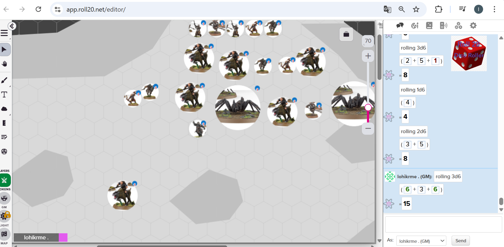
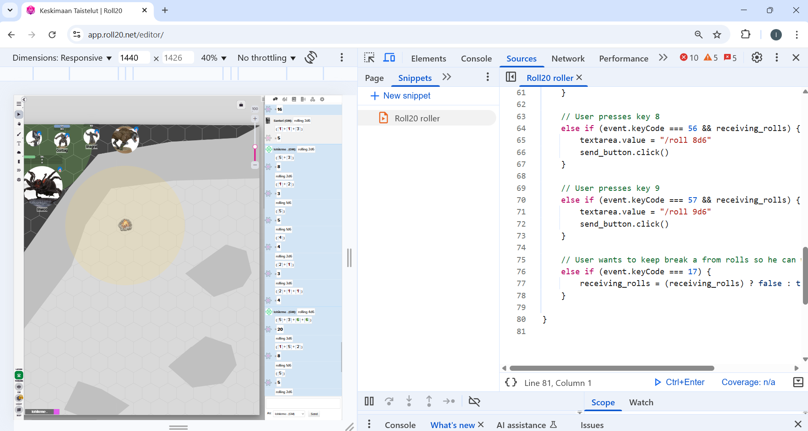

# Roll20-Dice-Roller

Hello! This is my Roll20 Dice Roller version 1.0.2.
For personal use only.
Last time updated: 11th january 2026 by lohikrme

## Where and how to use it?:

-   This code is intended to be used only in app.roll20.net/editor website
-   If this code is enabled on the browser and running while gaming at roll20 website, the player can just click a number between 1 and 9 on their keyboard to roll d6 dices
-   To pause rolling (e.g needs write normal numbers) the player can click the 'ESC' button on their keyboard to toggle rolling on/off.
-   as seen in image above, if dice roller is turned on, its logo will appear on right up corner of the chat
-   u can press letters 'd', 's', 'w', 'o', 'p', 'n' to determine, what kind of roll it is. This will change the state and therehow add a text after the roll. Different states are:
-   FIGHT
-   SHOOT
-   WOUND
-   OUTCOME
-   PRIORITY
-   NONE/NULL

## How to enable the code?:

-   Open web browser and press F12. This opens an inspector for you.
-   Find inside inspector "Sources" -> "Snippets" -> "New snippets" to create a new code
-   After copying and pasteing this code inside the new snippet and saving (for example with control + S), it will be saved on your browser inspector.
-   To start the code, open the roll20 website where u plan to play, and there open the inspector with F12, go to "Sources" -> "Snippets" and right click the snippet u already created. Select "Run".
-   This code will automatically turn off after closing the browser or the web page.

## Is it safe?:

This code is super safe. It does not store or send any kind of information, and it will work only on the web page it was turned on. E.g if you open roll20 website turn the snippet on there, other pages will act normally.
